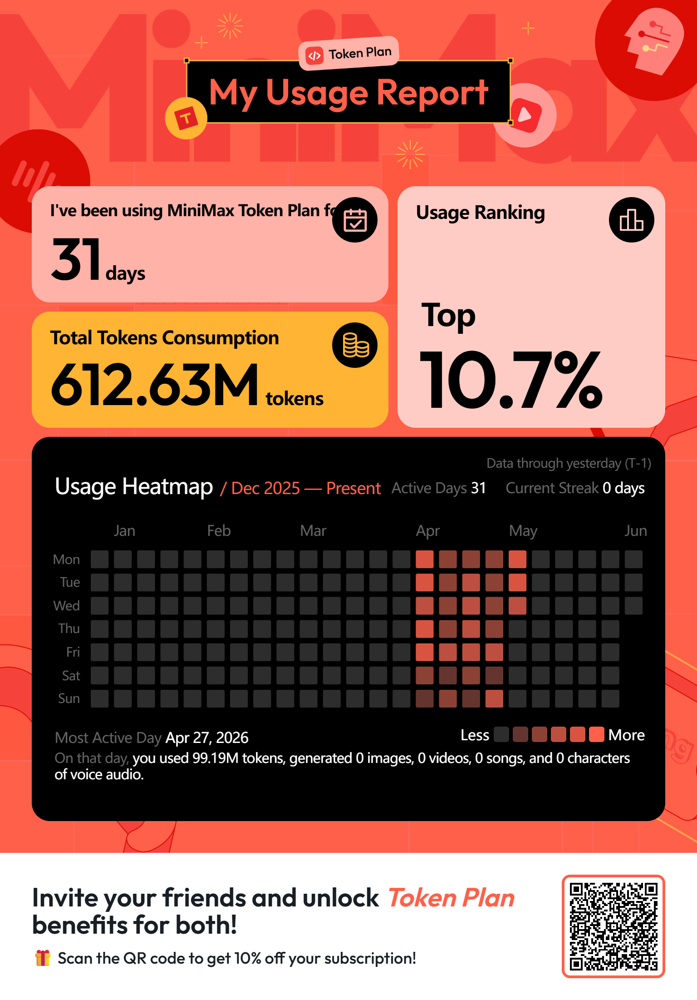
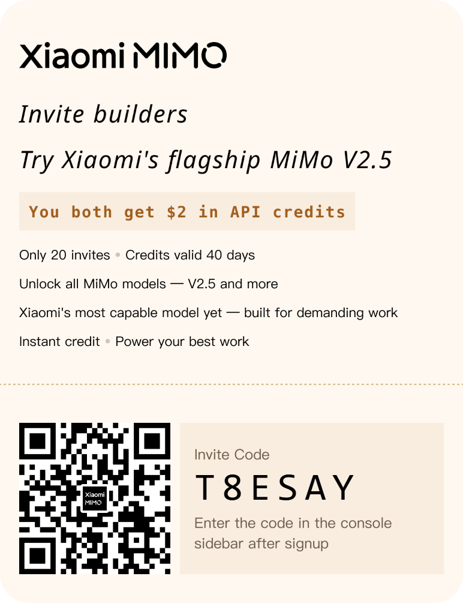

Many thanks to those who subscribe via my referral links! 🙏

## Claude Ecosystem

### [AgentKit](https://agentkit.best/?ref=BWA910UK)

AgentKit — formerly **ClaudeKit** (`claudekit.cc`) — packages production-ready skills, slash commands, subagents, and workflows for coding agents such as Claude Code, Codex, and GitHub Copilot, so sessions stay consistent instead of restarting from scratch every time.

- **AgentKit Engineer** ($99, one-time) — 100+ skills and 30+ workflows plus engineer subagents covering frontend, backend, databases, DevOps, code review, and debugging.
- **AgentKit Marketing** ($99, one-time) — 12+ MCP integrations and marketing subagents for lead research, programmatic SEO, content, and CRM outreach.
- **Bundle** ($149) — both kits plus a 1-year AgentKit App license for 3 devices. Combined, the kits ship 95+ commands and 45 subagents.
- **AgentKit App** ($49/year for 1 device, $99/year for 3) — a desktop control center for the `ak` CLI with kit management, a visual skill graph, and a status line builder.

All purchases include a 14-day refund guarantee.

Sign up via the referral link to get **20% off** your first purchase!

Referral code: `BWA910UK`

Link: https://agentkit.best/?ref=BWA910UK

## AI Coding Platforms & LLM APIs

### [OrcaRouter](https://www.orcarouter.ai/ref/ref_3976ba42abf37dc55c1d)

OrcaRouter lets you access 200+ AI models through one OpenAI-compatible API with automatic routing and failover.

Sign up through my referral link: https://www.orcarouter.ai/ref/ref_3976ba42abf37dc55c1d

Referral code: `ref_3976ba42abf37dc55c1d`

**TL;DR — current offers checked Oct 2, 2026 (UTC+7):**

- **Tencent Hy4 Preview:** Get a 100% deposit match, up to $200, on top-ups of $20 or more when you join before **Oct 29**. Credit is usable on Hy4 Preview only.
- **GPT-6 Astra:** Get a 100% deposit match, up to $100, on top-ups of $20 or more before **Oct 5**; a payment card is required and the offer is waitlisted.

Offers can change quickly, so check the [live offers page](https://www.orcarouter.ai/offers) before claiming.

### [Z.ai](https://z.ai/subscribe?ic=PLKIAYEIPW)

🚀 You've been invited to join the GLM Coding Plan! Enjoy full support for Claude Code, Cline, and 20+ top coding tools — starting at just $18/month. Subscribe now and grab the limited-time deal! Link： https://z.ai/subscribe?ic=PLKIAYEIPW

Until **Oct 7, 2026**, all-day usage is billed at the off-peak rate, and GLM-5.3-Flash is unlimited from 23:00 to 09:00.

### [Kimi](https://kimi-bot.com/activities/viral-referral/share?scenario=invite&from=share_poster&invitation_code=C8CJ6F)

Boost me and we both win! Sign up or subscribe to Kimi (Moonshot AI) and we each get a guaranteed membership-credit prize, ranging from 3 days up to **1 year**. Credits expire at the end of their duration or on Dec 31, 2026, whichever comes first.

- **Sign up:** https://kimi-bot.com/activities/viral-referral/share?scenario=invite&from=share_poster&invitation_code=C8CJ6F
- **Subscribe:** https://kimi-bot.com/activities/viral-referral/share?scenario=subscribe&from=share_poster&invitation_code=C8CJ6F

Invitation code: `C8CJ6F`

### [MiniMax](https://platform.minimax.io/subscribe/token-plan?code=CAQ5sxHAq6&source=link)

🎁 MiniMax Token Plan Referral Program — Token Plan starts at $20/month (Plus), with Max at $50 and Ultra at $120.

**How it works:**

- **For Referred Users:** Use a referral link to get **10% off** any Token Plan subscription or upgrade, and join the MiniMax Developer Community as a Builder.
- **For Referrers:** Earn **10% back in API credits** for every successful paid referral, valid for 90 days and usable across all MiniMax models. [View details](https://platform.minimax.io/docs/token-plan/faq)

Referral code: `CAQ5sxHAq6`

Link: https://platform.minimax.io/subscribe/token-plan?code=CAQ5sxHAq6&source=link

### [Synthetic](https://synthetic.new/?referral=CNBFyw28zF0dZoj)

Thanks for helping us grow!

Invite your friends to Synthetic and both of you will receive $10.00 off the first month when they subscribe! Subscriptions start at $30/month, with usage-based pricing as an alternative.

Share Your Referral Link

https://synthetic.new/?referral=CNBFyw28zF0dZoj

Your referral link contains your unique code: CNBFyw28zF0dZoj

### [Xiaomi MiMo](https://platform.xiaomimimo.com?ref=T8ESAY)

Xiaomi MiMo Open Platform — running Xiaomi's flagship MiMo V2.6 Pro and the rest of the lineup. Sign up with my code and you'll instantly get **$2** in API credits, plus **10% off** your first paid Token Plan order.

Enter the code within 3 days of signing up, at the bottom-left of the console. Credits valid **40 days**.

Referral code: `T8ESAY`

Link: https://platform.xiaomimimo.com?ref=T8ESAY

### [ModelArk](https://www.byteplus.com/activity/codingplan?ac=MMAUCIS9NT1S&rc=2739UWRE)

BytePlus ModelArk Coding Plan bundles Dola-Seed-2.0-pro, GLM-5.3-Flash, and the DeepSeek V4 series for Claude Code, Cursor, Cline, and other coding tools. Subscribe through my link to get **10% off** your first Coding Plan subscription.

https://www.byteplus.com/activity/codingplan?ac=MMAUCIS9NT1S&rc=2739UWRE

## Cloud Computing

### [Alibaba Cloud](https://www.alibabacloud.com/campaign/benefits?referral_code=A92LU5)

Alibaba Cloud is one of the world's largest cloud computing platforms — offering 50+ products including ECS, OSS, RDS, Redis, MongoDB, and networking.

**New user benefits (via referral):**

- Up to **$1,700** in free trial credits (individual) or **$8,500** (enterprise)
- **12-month free** ECS (Elastic Compute Service) trial
- **50+** products available in free trial
- New-user coupons and discounts on first orders

**How it works:** Sign up via the referral link as a new user → complete identity verification → access free trials and promotions.

Referral code: `A92LU5`

Link: https://www.alibabacloud.com/campaign/benefits?referral_code=A92LU5

## Managed Data Platforms

### [Aiven](https://console.aiven.io/signup?referral_code=dgxaaojd772ygmk7bjr6)

Aiven is a managed open-source data platform (Database-as-a-Service) — fully hosted databases, streaming, and analytics services deployable across all major clouds. Offerings include PostgreSQL, MySQL, Apache Kafka, ClickHouse, OpenSearch, Valkey, and more, managed from a single console. It is not a VPS or compute provider — you consume ready-to-use data services, not virtual machines.

Sign up via my referral link and start the Aiven trial to get an extra **$100.00 USD** in credits to spend.

Referral code: `dgxaaojd772ygmk7bjr6`

Link: https://console.aiven.io/signup?referral_code=dgxaaojd772ygmk7bjr6

## Cloud Storage

### [PikPak](https://mypikpak.com/drive/activity/invited?invitation-code=75940186)

PikPak is a private cloud storage service with built-in support for magnet links, torrents, and saving videos from the web — great for offline downloads and cross-device access.

Sign up with my invitation code to unlock **5 free premium days** with 10 TB of premium storage — no payment card required. Enter the code within 12 hours of registration, or install directly via the link to auto-bind the invitation.

Invitation code: `75940186`

Link: https://mypikpak.com/drive/activity/invited?invitation-code=75940186
